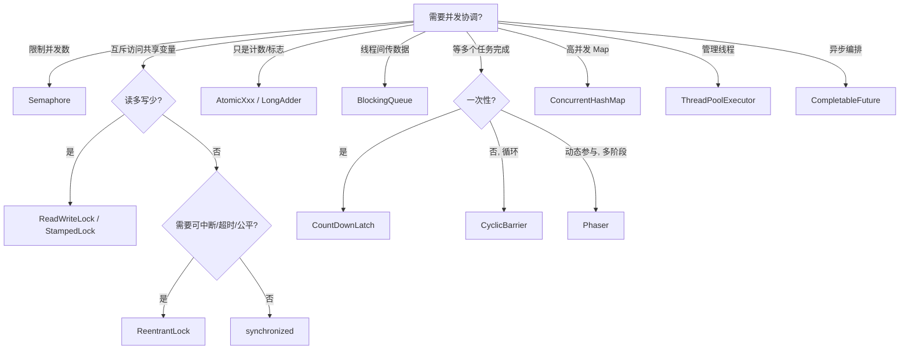

# Java Util Concurrent（JUC）核心并发工具类 - 米其林后厨协奏曲

## 引言

凌晨四点，米其林三星餐厅的后厨灯火通明：主厨、副厨、备料员、传菜员、前台服务员各司其职，今晚要把 200 桌客人的菜准时端上桌。本故事用一家忙碌的后厨重新讲一遍 Java Util Concurrent（JUC，完整包名：`java.util.concurrent`），把 12 个核心工具的 API 语义、易错点和选型直觉钉在画面上，方便长期记忆与面试速查。

## 英文全称与音标速查

> 音标以美式发音为主，类名按常见英文单词拆开读即可。

| 缩写/术语 | 全英文/完整形式 | 音标 | 中文理解 |
|---|---|---|---|
| JUC | Java Util Concurrent / `java.util.concurrent` | /ˈdʒɑːvə ˈjuːtəl kənˈkɜːrənt/ | Java 并发工具包 |
| ReentrantLock | Reentrant Lock | /riːˈentrənt lɑːk/ | 可重入锁 |
| ReadWriteLock | Read Write Lock | /riːd raɪt lɑːk/ | 读写锁 |
| StampedLock | Stamped Lock | /stæmpt lɑːk/ | 邮戳锁 |
| AtomicInteger | Atomic Integer | /əˈtɑːmɪk ˈɪntɪdʒər/ | 原子整数 |
| CountDownLatch | Count Down Latch | /ˈkaʊnt daʊn lætʃ/ | 倒计时门闩 |
| CyclicBarrier | Cyclic Barrier | /ˈsaɪklɪk ˈbæriər/ | 循环屏障 |
| Semaphore | Semaphore | /ˈseməfɔːr/ | 信号量 |
| Phaser | Phaser | /ˈfeɪzər/ | 阶段器 |
| ConcurrentHashMap | Concurrent Hash Map | /kənˈkɜːrənt hæʃ mæp/ | 并发哈希表 |
| BlockingQueue | Blocking Queue | /ˈblɑːkɪŋ kjuː/ | 阻塞队列 |
| ExecutorService | Executor Service | /ɪɡˈzekjətər ˈsɜːrvɪs/ | 执行器服务 |
| CompletableFuture | Completable Future | /kəmˈpliːtəbəl ˈfjuːtʃər/ | 可完成 Future |

## 主要角色介绍

> 每个角色固定五段式：**画面 → 性格特点 → 核心 API/参数 → 易错点 → 易混对手**。

### 锁家族 - 后厨的钥匙与门禁

#### 1. ReentrantLock（Reentrant Lock /riːˈentrənt lɑːk/）- 主厨的冷库钥匙

- **画面**：主厨进冷库锁门，发现要回灶台拿盘子，再回来还能用同一把钥匙——钥匙上挂一个计数器，每进一次拨一格、每出一次拨回来。
- **性格特点**：忠诚可靠，可重入；公平可选，能被中断、能超时、能挂多组等待条件。
- **核心 API/参数**：`lock()` / `unlock()`、`tryLock(timeout, unit)`、`lockInterruptibly()`、构造参数 `fair`（公平/非公平）、`newCondition()` 拿到 `Condition` 做精细等待/唤醒。
- **易错点**：`unlock()` 必须在 `finally` 里；`lock()` N 次必须 `unlock()` N 次（hold count 归零才真正释放）；公平模式吞吐显著低于非公平。
- **易混对手**：`synchronized` 不能中断、不能超时、只有一组 wait set；`Semaphore(1)` 不可重入。

#### 2. ReadWriteLock（Read Write Lock /riːd raɪt lɑːk/）- 祖传菜谱本管理员

- **画面**：菜谱被多个厨师同时翻看（读锁共享），但要修改时必须独占（写锁排他）。
- **性格特点**：读多写少时效率极高；支持锁降级（写锁→读锁），不支持锁升级。
- **核心 API/参数**：`readLock().lock()` / `unlock()`、`writeLock().lock()` / `unlock()`、`ReentrantReadWriteLock(fair)`。
- **易错点**：**读锁不能升级写锁**（线程持有读锁时再请求写锁会自我死锁）；**写锁可以降级为读锁**（持写锁时先获取读锁，再释放写锁）；写锁默认避免饥饿但读极多时仍可能饿。
- **易混对手**：`StampedLock` 多了乐观读但不可重入、不支持 Condition；`synchronized` 没有读写区分。

#### 3. StampedLock（Stamped Lock /stæmpt lɑːk/）- 菜谱版本号

- **画面**：菜谱右上角写着版本号，先瞄一眼记下来快速读完，起身前再核对一次没变就走人；变了再去排队读锁。
- **性格特点**：乐观派，三态（乐观读、悲观读、写）；高并发读时性能极佳，但 API 复杂、写多时反而更差。
- **核心 API/参数**：`tryOptimisticRead()` 拿 stamp、`validate(stamp)` 校验、`readLock()` / `writeLock()` / `unlockRead(stamp)` / `unlockWrite(stamp)`、`tryConvertToWriteLock`。
- **易错点**：**不可重入**！**不支持 Condition**！乐观读期间若读多个变量要本地拷贝再 `validate`，否则可能读到中间态；写偏多场景反而更慢。
- **易混对手**：`ReadWriteLock` 没有乐观读；`volatile` 只保证单变量可见性，不能给一组变量做一致性快照。

### 原子家族 - 后厨的发号机

#### 4. AtomicInteger / AtomicLong / AtomicReference（Atomic Integer /əˈtɑːmɪk ˈɪntɪdʒər/，Atomic Long /əˈtɑːmɪk lɔːŋ/，Atomic Reference /əˈtɑːmɪk ˈrefrəns/）- 取餐号码机

- **画面**：每按一下吐一个号；100 人同时按也绝不会同号——背后是 CPU 级 CAS。
- **性格特点**：操作不可分割；轻量级，无锁高性能；适合单变量。
- **核心 API/参数**：`get()` / `set()`、`getAndIncrement()`、`compareAndSet(expect, update)`、`updateAndGet(fn)`、`accumulateAndGet`。
- **易错点**：**ABA 问题**——值被改回原值你看不出来，需用 `AtomicStampedReference` 加版本号；高竞争下 CAS 大量自旋会烧 CPU，应换 `LongAdder` / `LongAccumulator`（按线程分槽，求和才汇总）。
- **易混对手**：`volatile` 只保证可见性、不保证复合操作原子性；`synchronized` 重得多。

### 同步器家族 - 后厨的协调铃

#### 5. CountDownLatch（Count Down Latch /ˈkaʊnt daʊn lætʃ/）- 备料就绪铃

- **画面**：开餐前 5 项备料，每备好一项敲一下铃，主管等铃响 5 次开门——只开一次。
- **性格特点**：一次性使用，倒计时归零后所有 `await` 立即返回；不可重置。
- **核心 API/参数**：`new CountDownLatch(N)`、`countDown()`、`await()` / `await(timeout, unit)`、`getCount()`。
- **易错点**：**一次性**，归零后不能复用；`countDown()` 必须在 `finally` 中调用，否则任何子线程异常都会让主线程永久卡住。
- **易混对手**：`CyclicBarrier` 可循环且双向（多个工作线程互等），`CountDownLatch` 是单向"一个等多个"。

#### 6. CyclicBarrier（Cyclic Barrier /ˈsaɪklɪk ˈbæriər/）- 8 个出菜口的"集合开盖"

- **画面**：8 个出菜口必须全部摆盘完毕才一起开盖；这一道结束后回到屏障等下一道。
- **性格特点**：可重复使用，循环等待；支持到达后自动触发 `barrierAction`。
- **核心 API/参数**：`new CyclicBarrier(parties, barrierAction)`、`await()` / `await(timeout, unit)`、`reset()`、`isBroken()`、`getNumberWaiting()`。
- **易错点**：任一线程超时/中断/异常会让屏障进入 **broken** 状态，其他等待线程抛 `BrokenBarrierException`，需 `reset()` 才能复用；`barrierAction` 由"最后到达"的线程执行，跑重活会拖慢屏障。
- **易混对手**：`CountDownLatch` 一次性、单向；`Phaser` 是 `CyclicBarrier` 的"动态参与者 + 阶段编号"加强版。

#### 7. Semaphore（Semaphore /ˈseməfɔːr/）- 餐厅 20 张桌子

- **画面**：餐厅 20 张桌 = 20 张号牌，进门领号、离开归还，号牌发完就排队。
- **性格特点**：限制同时访问的线程数量；支持公平/非公平、可中断、可超时。
- **核心 API/参数**：`new Semaphore(permits, fair)`、`acquire(n)` / `release(n)`、`tryAcquire(timeout, unit)`、`drainPermits`。
- **易错点**：`release()` 必须在 `finally`；当作互斥锁用时（permits=1）**不可重入**——同线程二次 `acquire` 会自我死锁；`release` 可以多发，permit 数会涨，要确保 acquire/release 严格成对。
- **易混对手**：`ReentrantLock` 可重入、有 Condition；`BlockingQueue` 不只发许可还传数据。

#### 8. Phaser（Phaser /ˈfeɪzər/）- 婚宴多阶段总控

- **画面**：宴席分凉菜、热菜、甜点三阶段，每阶段参与者数量可临时增减。
- **性格特点**：支持动态注册/退出；带阶段编号；支持每阶段钩子。
- **核心 API/参数**：`register()` / `bulkRegister(n)`、`arrive()` / `arriveAndAwaitAdvance()` / `arriveAndDeregister()`、`onAdvance(phase, parties)` 钩子、`getPhase()`。
- **易错点**：动态注册要在到达屏障**之前**完成；`onAdvance` 返回 `true` 会终止 phaser，常用于限定阶段总数。
- **易混对手**：`CyclicBarrier` 参与者固定；`CountDownLatch` 一次性，都不支持动态注册。

### 并发集合家族 - 后厨的储物与传送

#### 9. ConcurrentHashMap（Concurrent Hash Map /kənˈkɜːrənt hæʃ mæp/）- 分区储物柜

- **画面**：储物柜分若干槽，开 A 槽不影响 B 槽；只有同槽位才需要互锁。
- **性格特点**：高并发性能；线程安全；JDK 8 起锁粒度精细到桶头节点。
- **核心 API/参数**：`putIfAbsent`、`computeIfAbsent` / `compute` / `merge`、`forEach` / `search` / `reduce`，构造参数 `concurrencyLevel`（JDK 8+ 仅作初始 hint）。
- **易错点**：JDK 7 是 Segment 分段锁，**JDK 8 起改为 CAS + `synchronized` 锁桶头**；`size()` 是估算（用 `mappingCount()` 拿 long）；迭代是**弱一致**（不会抛 `ConcurrentModificationException`，但可能漏看新写）；**复合操作必须用 `putIfAbsent` / `computeIfAbsent`**，`if (!containsKey) put` 不是原子。
- **易混对手**：`Collections.synchronizedMap` 是粗粒度全表锁；`HashMap` 在多线程下 JDK 7 会形成环、JDK 8 会丢数据。

#### 10. BlockingQueue（Blocking Queue /ˈblɑːkɪŋ kjuː/）- 出菜传送带

- **画面**：厨师 `put` 满了就等，传菜员 `take` 空了就等，传送带形态决定后厨节奏。
- **性格特点**：天然生产者-消费者模式；阻塞、超时、非阻塞三套 API。
- **核心 API/参数**：`put` / `take`（阻塞）、`offer(e, timeout)` / `poll(timeout)`（超时）、`add` / `remove`（抛异常）、`offer` / `poll`（返回布尔/null）。
- **易错点**：**`LinkedBlockingQueue` 不传容量参数默认 `Integer.MAX_VALUE`，等同无界，会 OOM**；`SynchronousQueue` 容量为 0，必须 put 和 take 同时存在才成交（`newCachedThreadPool` 用的就是它）；`PriorityBlockingQueue` 无界且无公平。
- **易混对手**：`ConcurrentLinkedQueue` 是非阻塞队列；`ArrayBlockingQueue` 单锁、`LinkedBlockingQueue` put/take 双锁（吞吐更高但更耗内存）。

### 执行器家族 - 后厨的人事编制与异步出菜

#### 11. ExecutorService / ThreadPoolExecutor（Executor Service /ɪɡˈzekjətər ˈsɜːrvɪs/）- 厨师团队编制

- **画面**：长期员工（核心线程）+ 候餐区（队列）+ 高峰期临时工（最大线程数）+ 拒收政策（拒绝策略）。
- **性格特点**：管理线程池，自动调度任务；支持优雅关闭与生命周期。
- **核心 API/参数（七参数）**：`corePoolSize`、`maximumPoolSize`、`keepAliveTime` + `TimeUnit`、`workQueue`、`threadFactory`、`RejectedExecutionHandler`。提交：`execute` / `submit`；关闭：`shutdown` / `shutdownNow` / `awaitTermination`。
- **易错点**：**执行流程死记**——先用核心线程→排进队列→队列满才扩到 max→再满才走拒绝策略；`Executors.newFixedThreadPool` / `newSingleThreadExecutor` 用无界 `LinkedBlockingQueue` 会 OOM；`newCachedThreadPool` 上限 `Integer.MAX_VALUE` 会爆线程；阿里规约要求**禁止 `Executors`，必须 `new ThreadPoolExecutor`** 自己定容量。
- **易混对手**：`ScheduledThreadPoolExecutor` 是定时版；`ForkJoinPool` 是分治+任务窃取版（CompletableFuture 默认 commonPool 就是它）。

#### 12. CompletableFuture（Completable Future /kəmˈpliːtəbəl ˈfjuːtʃər/）- 前台异步协奏

- **画面**：客人下单（`supplyAsync`）→ 凉菜先来（`thenApply`）→ 同时上沙拉（`thenCombine`）→ 谁先到谁先上（`anyOf`）→ 全到齐才上桌（`allOf`）→ 出错改"今日特价"（`exceptionally` / `handle`）。
- **性格特点**：支持异步编程；链式调用、组合操作、异常处理一应俱全。
- **核心 API/参数**：`supplyAsync` / `runAsync`、`thenApply` / `thenAccept` / `thenRun`、`thenCompose`、`thenCombine`、`allOf` / `anyOf`、`exceptionally` / `handle` / `whenComplete`、`*Async` 后缀切线程池。
- **易错点**：默认线程池是 `ForkJoinPool.commonPool()`，**IO 密集场景必须传自定义线程池**；`thenApply` 接受同步 `Function`，`thenCompose` 接受返回 `CompletionStage` 的函数（避免 `CompletableFuture<CompletableFuture<X>>` 嵌套）；`get()` 抛受检 `ExecutionException`，`join()` 抛运行时 `CompletionException`。
- **易混对手**：`Future` 不能链式编排、不能合并；`thenApply` vs `thenCompose` = 同步映射 vs 异步接力。

## 故事正文：米其林后厨协奏曲

### 序章：今晚 200 桌

凌晨四点，主厨陆远站在后厨中央。今晚要送出 200 桌、平均每桌 8 道菜的米其林晚宴。这意味着同时有约 30 名厨师、约 15 名传菜员、约 10 名前台服务员，再加上 4 个备料站、6 个储物柜、2 条传送带和无数个号码牌在并发运转。

"线程多了，活就乱。" 陆远说，"幸好我们有 JUC。"

### 第一幕：备料就绪铃 - CountDownLatch

汤底、米饭、配菜、酱料、餐具——5 项备料缺一不可。陆远在门口立了一口铜铃，每备好一项就敲一下。备料员们各自在四个备料站冲刺，谁先备好谁先敲，敲完就回去支援别人。

陆远盯着铃响："5……4……3……2……1。" 第 5 声过后，他猛地推开后厨大门：今晚开张。

但这口铃只能用一次。下一场晚宴要再备料？得换一口新铃。

> **记忆锚点**
> - 画面：5 项备料各敲一下铜铃，归零开门。
> - 语义：`new CountDownLatch(5)` + 子线程 `countDown()` + 主线程 `await()`，归零即放行。
> - 口诀：**敲到零，门一开，铃只响一次**。
> - 易混：`CyclicBarrier` 是大家互等且可循环；`CountDownLatch` 是一个等一群且一次性。

### 第二幕：8 个出菜口的"集合开盖" - CyclicBarrier

晚宴进入第三轮上菜：佛跳墙。这道菜要 8 个出菜口同时开盖，气势才足。每个出菜口的主厨备好后站在窗前喊"到！"，然后等其他 7 个口。

最后一个到的主厨触发了 `barrierAction`：礼宾员敲响开盖锣，8 个盖子齐齐掀开，水汽冲天。这一道结束后，8 个出菜口又回到原位等下一道。

意外发生：第七出菜口的副厨打翻了汤盆受伤，超时未到。整个屏障进入 broken 状态，剩下 7 人一起抛出 `BrokenBarrierException`。陆远赶来 `reset()`，重新组织。

> **记忆锚点**
> - 画面：8 个出菜口集合-一起开盖-回到原位-再集合。
> - 语义：`new CyclicBarrier(8, openLid)`，`await()` 互等可循环；任一线程异常 → broken。
> - 口诀：**人齐才走，循环往复，断了要 reset**。
> - 易混：`barrierAction` 由"最后到的人"执行，跑重活会拖慢屏障。

### 第三幕：传送带 - BlockingQueue

后厨与传菜口之间架着一条传送带。厨师把做好的菜 `put` 上去，满了就站着等位；传菜员从另一端 `take`，空了就抽烟等。这就是经典的生产者-消费者。

陆远的传送带选型有讲究：

- 普通正餐用 **`ArrayBlockingQueue(50)`**：长度固定，生产消费节奏可控。
- 紧急加单用 **`SynchronousQueue`**：没有传送带，厨师做好直接交到传菜员手上，谁慢谁等。
- VIP 桌的菜用 **`PriorityBlockingQueue`**：插队上桌。
- 预约的"卡时间"菜用 **`DelayQueue`**：到点才能取出。

而隔壁山寨餐厅用了 `LinkedBlockingQueue` 没传容量，结果厨师疯狂 put、传菜员速度跟不上，传送带堆到天花板，整个内存爆了——OOM。

> **记忆锚点**
> - 画面：满了等、空了等，传送带类型决定后厨脾气。
> - 语义：`put` / `take` 阻塞，`offer/poll` 超时，`add/remove` 抛异常。
> - 口诀：**Linked 不传容量必 OOM；Synchronous 无传送带；Priority 插队；Delay 到点取**。
> - 易混：`ArrayBQ` 单锁、`LinkedBQ` 双锁（put/take 分锁，吞吐更高但更耗内存）。

### 第四幕：取餐号码机不会跳号 - AtomicXxx

前台立着一台取餐号码机，每按一下吐出一个号。哪怕 100 个客人同时按，也绝不会出现两人同号。这背后是 CPU 级的 **CAS**（Compare-And-Swap）：我看到当前是 17，我想改成 18，CPU 帮我确认"现在还是 17 吗？"——是就改，不是就重来。

但有个怪事：3 号客人取号时是 17，他被领位走开后，号码经历了 17→18→17 的循环回到 17。回来一看号还是 17，他以为没变过。这就是 **ABA 问题**——光看值不行，得加版本号（`AtomicStampedReference`）。

晚宴最高峰时，普通的 `AtomicLong` 因为 CAS 大量失败开始疯狂自旋，CPU 占用飙升。陆远换了 `LongAdder`：把热点拆成多个分槽，每个线程往自己的槽加，最后 `sum()` 一次性汇总——竞争分散，吞吐翻倍。

> **记忆锚点**
> - 画面：号码机 + CPU 在旁监工"现在是 17 吗？是的话改成 18"。
> - 语义：CAS 单变量原子操作；ABA 用版本号解决；高竞争用 `LongAdder`。
> - 口诀：**CAS 自旋怕竞争，ABA 加印记，热点用 LongAdder**。
> - 易混：`volatile` 只保可见性不保原子；`synchronized` 重得多。

### 第五幕：主厨的冷库钥匙 - ReentrantLock

冷库里放着今晚最贵的食材。主厨陆远腰间挂一把钥匙，进冷库要锁门。中途他想起灶台上的酱要看一眼，跑回去——再回到冷库时还能用同一把钥匙开门，因为钥匙上有计数器，进了拨一格、出来拨一格，归零才真正交回钥匙架。

陆远还玩了几招：

- `tryLock(2, SECONDS)`：等 2 秒拿不到就走，宁可换条路也不死等。
- `lockInterruptibly()`：副手在外面喊"陆师傅，火上的菜糊了！"，陆远立刻放下冷库的活冲出去。
- 公平模式：节假日把钥匙改成"按到达顺序发"，免得同一个副厨抢得最猛。

最重要的一条：拿了钥匙必须 `try { ... } finally { unlock(); }`。哪怕中途菜烧糊了、肉切到手了，钥匙必须归还。否则整个冷库永久封闭。

> **记忆锚点**
> - 画面：钥匙带计数器，进出都拨一下；中途可被叫出来，可超时放弃。
> - 语义：`lock`/`unlock` 配对，`tryLock`/`lockInterruptibly` 增强能力，`fair` 控制公平。
> - 口诀：**try-finally 必 unlock；hold count 归零才真正放手**。
> - 易混：`synchronized` 不能中断、不能超时、只能一组 wait set；`Semaphore(1)` 不可重入。

### 第六幕：祖传菜谱本 - ReadWriteLock

后厨墙上挂着一本祖传菜谱。平时几个厨师同时翻看（共享读锁），相安无事。但每月一次菜单更新时，主厨陆远要在菜谱上写新方子，这时整本菜谱必须独占（独占写锁），所有读者请出门外。

陆远写完后想顺便检查一遍其他菜，于是**把写锁降级为读锁**：先 `readLock.lock()`，再 `writeLock.unlock()`。这样既能让其他读者重新进来，自己又不必从头排队。

但他的徒弟犯过一个错：拿着读锁正读着，突然想改一行字，直接 `writeLock.lock()`——挂起了。因为他自己持有的读锁还没释放，写锁永远等不到。**读锁不能升级为写锁**。

> **记忆锚点**
> - 画面：菜谱 = 资源，读者共享，写者独占；写完顺手降级继续读。
> - 语义：`ReentrantReadWriteLock`；写→读可降级，读→写会死锁。
> - 口诀：**多读共享、独写排他；可降级、不可升级**。
> - 易混：`StampedLock` 多了乐观读但不可重入、不支持 Condition。

### 第七幕：菜谱版本号 - StampedLock

陆远后来给菜谱右上角加了一个版本号。读菜谱时大多数人不再排队拿读锁，而是先瞄一眼版本号（`tryOptimisticRead` 拿一个 stamp），快速读完，起身前再扫一眼版本号（`validate(stamp)`）：

- 没变 → 走人，全程零锁开销。
- 变了 → 老老实实 `readLock()` 排队读一遍。

唯一的代价：StampedLock 不可重入、不支持 Condition；写多读少时反而比 ReadWriteLock 还慢（写者频繁让乐观读失败）。陆远只在"读极多、写极少"的菜谱上用它。

> **记忆锚点**
> - 画面：先看版本号，读完再核对一次；对得上零锁，对不上排队。
> - 语义：`tryOptimisticRead`/`validate` 乐观读；`readLock`/`writeLock` 悲观读写。
> - 口诀：**先瞄后核，零锁高速；不重入、无 Condition**。
> - 易混：写偏多场景反而比 `ReadWriteLock` 慢。

### 第八幕：餐厅只有 20 张桌子 - Semaphore

前厅有 20 张桌子。客人进门先到吧台领号（`acquire`），坐下用餐，离开时归还（`release`）。号牌只有 20 个，发完就排队等。

这天来了一个机灵的常客，他领了号坐下后想再抢一张桌子放包，于是又 `acquire` 一次——直接卡死了。原来 Semaphore 当互斥锁用时**不可重入**。

收银员还干过一件危险的事：客人没还号就走了，她"补"了一次 `release`，结果许可数变成 21；下次开张时凭空多了一张桌子。`release` 可以多发是个隐患，写代码时要保证 acquire/release 严格成对。

> **记忆锚点**
> - 画面：20 张桌子 = 20 张号牌，发完排队，归还续发。
> - 语义：`acquire`/`release` + `tryAcquire(timeout)` 限并发；可作互斥但不可重入。
> - 口诀：**许可即并发上限；release 多发会涨数**。
> - 易混：`BlockingQueue` 传数据，`Semaphore` 只发许可。

### 第九幕：婚宴多阶段总控 - Phaser

周末包场办婚宴，菜单分三阶段：凉菜（10 人摆盘）、热菜（15 人）、甜点（5 人）。陆远用一台 Phaser 总控。

- 第一阶段开始前，10 个凉菜师 `register()`，到位后 `arriveAndAwaitAdvance()` 一起进入下一阶段。
- 第二阶段时凉菜师下班，5 个新热菜师 `register()` 加入，原有 10 人留下；阶段编号从 0 跳到 1。
- 甜点阶段时绝大多数人 `arriveAndDeregister()` 退出，只剩 5 个甜点师收尾。
- 陆远用 `onAdvance(phase, parties)` 在每阶段结束时打一次"鸣锣"；返回 `true` 时整个 Phaser 终止，宴席结束。

> **记忆锚点**
> - 画面：阶段会变、人数会变，每个阶段都有自己的"人齐才上"。
> - 语义：`register`/`arriveAndDeregister` 动态参与者，`arriveAndAwaitAdvance` 阶段屏障，`onAdvance` 钩子。
> - 口诀：**动态人数、阶段编号，CyclicBarrier Pro Max**。
> - 易混：`CyclicBarrier` 人数固定；`CountDownLatch` 一次性。

### 第十幕：分区储物柜 - ConcurrentHashMap

后厨墙边一排储物柜，每个抽屉编号不同。多个厨师同时去拿不同抽屉的食材完全互不干扰；只有同一抽屉才需要互锁。

陆远讲历史：

- JDK 7 时代，柜子分 16 个 Segment，每个 Segment 一把锁，并发度 ≈ 16。
- JDK 8 改成更细：以"桶头节点"为锁，CAS 抢空桶，桶里有元素才用 `synchronized` 锁住链表/红黑树头——并发度 ≈ 桶数。

新来的实习生写出过这种代码：

```java
if (!menu.containsKey(dish)) {
    menu.put(dish, recipe);
}
```

陆远当场否决——这是**复合操作**，containsKey 与 put 之间窗口期会让两个线程都判断"不存在"然后各自 put，覆盖彼此。正确写法：`menu.putIfAbsent(dish, recipe)` 或 `menu.computeIfAbsent(dish, k -> loadRecipe(k))`，原子。

另外 `size()` 是估算值，迭代是弱一致——你迭代时别人修改不会抛 `ConcurrentModificationException`，但也可能漏看新插入。

> **记忆锚点**
> - 画面：每个抽屉自己上锁，开 A 不影响 B；同抽屉才互等。
> - 语义：JDK 8 起 CAS + `synchronized` 桶头；`putIfAbsent`/`computeIfAbsent` 原子复合。
> - 口诀：**复合操作必用原子方法；size 是估算，迭代弱一致**。
> - 易混：`Collections.synchronizedMap` 是粗粒度全表锁，性能远不如 CHM。

### 第十一幕：厨师团队编制 - ThreadPoolExecutor

陆远在白板上画了餐厅的人事编制。一份合格的"线程池"长这样：

| 参数 | 后厨含义 |
|---|---|
| `corePoolSize` | 长期员工数 |
| `maximumPoolSize` | 高峰期最多临时工数 |
| `keepAliveTime` + `unit` | 临时工没活时多久走人 |
| `workQueue` | 候餐区（队列） |
| `threadFactory` | 员工胸牌制作工厂（命名/守护态） |
| `RejectedExecutionHandler` | 拒收政策 |

执行顺序死记四步走：

1. 来一单，先派**核心员工**（哪怕队列空也优先开新核心线程，直到 corePoolSize 满）。
2. 核心满了，单子进**队列**等。
3. 队列也满了，再招**临时工**直到 maximumPoolSize。
4. 临时工也满了，触发**拒绝策略**：`AbortPolicy` 报错、`CallerRunsPolicy` 让点单的客人自己做、`DiscardPolicy` 偷偷扔单、`DiscardOldestPolicy` 把队头最早的客人轰走。

陆远严令禁止使用 `Executors.newFixedThreadPool` / `newSingleThreadExecutor`——它们用无界队列，单一旦堆积无限等于内存爆炸；`newCachedThreadPool` 上限是 `Integer.MAX_VALUE`，会爆线程。**永远 `new ThreadPoolExecutor`**。

> **记忆锚点**
> - 画面：长期员工 → 候餐区 → 临时工 → 拒收政策。
> - 语义：七参数 + 提交执行顺序 + 4 种内置拒绝策略。
> - 口诀：**先核心、再队列、再 max、再拒绝**。
> - 易混：`ScheduledThreadPoolExecutor` 是定时版；`ForkJoinPool` 是分治+任务窃取。

### 第十二幕：前台异步协奏 - CompletableFuture

前台服务员小赵的工作流程像一条流水线：

- 客人下单：`supplyAsync(() -> takeOrder())`。
- 凉菜先上：`.thenApply(order -> coldDish(order))`——同步映射，下一步用前一步的结果。
- 想再发起一个异步炒制？用 `.thenCompose(order -> kitchen.cookAsync(order))`——异步接力，避免 `CompletableFuture<CompletableFuture<Dish>>` 嵌套。
- 同时上沙拉：`.thenCombine(saladFuture, (main, salad) -> plate(main, salad))`——合并两条线。
- 甜点不重要，谁先到就先上：`anyOf(iceCream, cake)`。
- 必须凑齐才能上桌：`allOf(soup, main, dessert).thenRun(serve)`。
- 出错改"今日特价"：`.exceptionally(ex -> todaysSpecial())` 或 `.handle((r, ex) -> ...)`。

小赵踩过两个坑：

1. 没传线程池，所有异步任务都跑在 `ForkJoinPool.commonPool()`，那是**按 CPU 核数**算的，IO 密集任务一堵就堵死。修：`supplyAsync(task, ioPool)`、`thenApplyAsync(fn, ioPool)`。
2. 调试时混用 `get()` 和 `join()`：`get` 抛受检 `ExecutionException`，`join` 抛运行时 `CompletionException`，处理方式不同。

> **记忆锚点**
> - 画面：下单 → 凉菜 → 沙拉 → 主菜 → 上桌；其中任一步出错就走特价。
> - 语义：`supplyAsync`/`thenApply`/`thenCompose`/`thenCombine`/`allOf`/`anyOf`/`exceptionally`；`Async` 后缀切线程池。
> - 口诀：**Apply 同步映射、Compose 异步接力、Combine 合并两线、All/Any 凑齐或抢先**。
> - 易混：默认线程池 `commonPool` 不适合 IO 密集，必须传自定义池。

## 终章：打烊清单

后厨打烊，陆远把今晚用到的工具按场景列了一遍：

1. **等多个子任务完成主线程才继续** —— `CountDownLatch`（一次性）。
2. **多个线程互等，到齐再一起冲，冲完循环** —— `CyclicBarrier`。
3. **多阶段、参与者动态变化的复杂协作** —— `Phaser`。
4. **限制并发数（限流、连接池、桌位）** —— `Semaphore`。
5. **轻量级原子计数 / 标志 / 引用** —— `AtomicXxx`，高竞争换 `LongAdder`。
6. **手动控制锁，需要可中断 / 超时 / 公平 / 多 Condition** —— `ReentrantLock`。
7. **读多写少的共享数据** —— `ReentrantReadWriteLock`，极致优化用 `StampedLock`。
8. **高并发 Map** —— `ConcurrentHashMap` + `putIfAbsent` / `computeIfAbsent`。
9. **生产者-消费者 / 解耦不同速率的线程** —— `BlockingQueue` 全家。
10. **管理一组工作线程** —— `ThreadPoolExecutor`（自己 new，禁用 `Executors.newXxx`）。
11. **复杂异步编排、链式回调、任务合并** —— `CompletableFuture`。

## 总记忆表（一页速查）

| 工具 | 后厨画面 | 核心 API/参数 | 一句口诀 | 易混对手 |
|---|---|---|---|---|
| ReentrantLock | 主厨冷库钥匙 + 计数器 | `lock`/`unlock`/`tryLock`/`lockInterruptibly`/`fair` | try-finally 必 unlock，hold count 归零才放手 | `synchronized`（不能中断/超时）、`Semaphore(1)`（不可重入） |
| ReadWriteLock | 祖传菜谱本 | `readLock`/`writeLock`，写→读可降级 | 多读共享、独写排他；可降级、不可升级 | `StampedLock`（乐观读但不可重入） |
| StampedLock | 菜谱版本号 | `tryOptimisticRead`/`validate`/`readLock`/`writeLock` | 先瞄后核，零锁高速 | `ReadWriteLock`（无乐观读） |
| AtomicXxx | 取餐号码机 | `compareAndSet`/`getAndIncrement`/`updateAndGet` | CAS 防 ABA，热点用 `LongAdder` | `volatile`（只可见不原子） |
| CountDownLatch | 备料就绪铃 | `await`/`countDown` | 敲到零，门一开，铃只响一次 | `CyclicBarrier`（可循环、互等） |
| CyclicBarrier | 8 出菜口集合开盖 | `await`/`barrierAction`/`reset` | 人齐才走，循环往复，断了要 reset | `Phaser`（人数动态、有阶段） |
| Semaphore | 餐厅 20 张桌 | `acquire`/`release`/`tryAcquire` | 许可即并发上限 | `ReentrantLock`（可重入） |
| Phaser | 婚宴多阶段总控 | `register`/`arriveAndDeregister`/`arriveAndAwaitAdvance`/`onAdvance` | 动态人数、阶段编号 | `CyclicBarrier`（固定人数） |
| ConcurrentHashMap | 分区储物柜 | `putIfAbsent`/`computeIfAbsent`/`merge` | 复合操作必用原子方法 | `synchronizedMap`（粗粒度） |
| BlockingQueue | 出菜传送带 | `put`/`take`/`offer`/`poll` | Linked 不传容量必 OOM | `ConcurrentLinkedQueue`（非阻塞） |
| ThreadPoolExecutor | 厨师团队编制 | 七参数 + 4 拒绝策略 | 先核心、再队列、再 max、再拒绝 | `Executors.newXxx`（禁用） |
| CompletableFuture | 前台异步协奏 | `supplyAsync`/`thenApply`/`thenCompose`/`thenCombine`/`allOf`/`anyOf`/`exceptionally` | Apply 映射、Compose 接力、Combine 合并、All/Any 凑齐或抢先 | `Future`（不能编排） |

## 选型决策树



## 一句话收尾

> 并发不是堆工具，而是**选合适的协作模式**。把每个 JUC 工具想象成米其林后厨里一个固定岗位，下次写代码时问自己："这个场景在后厨里对应谁的活？"——答案就是你要用的类。
